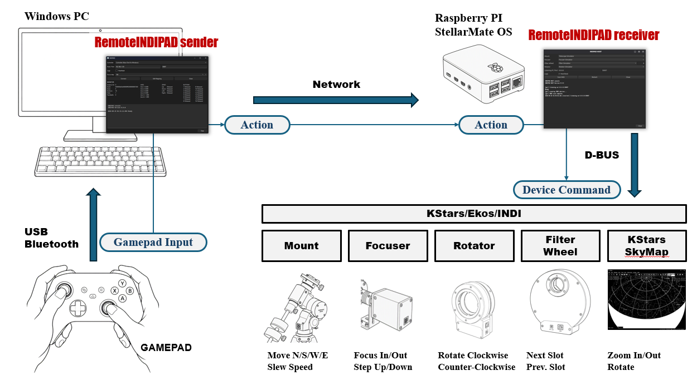
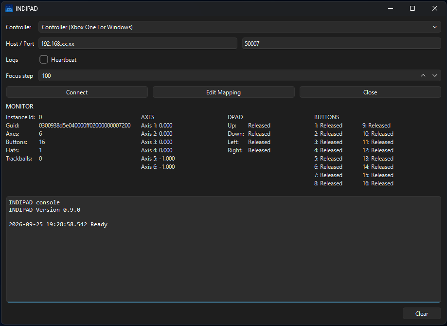
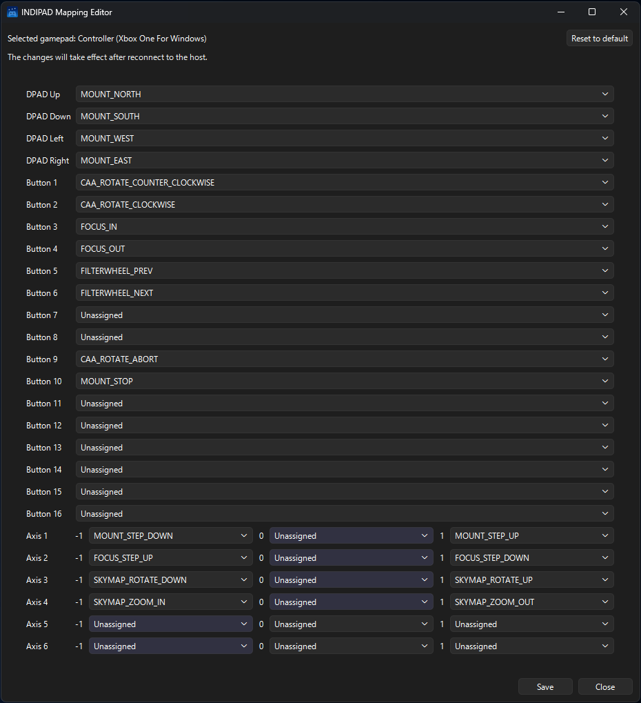
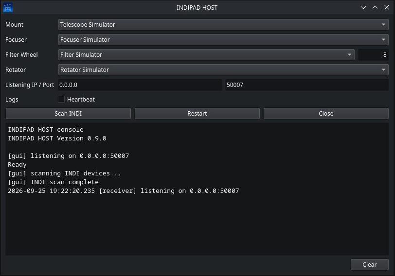

# RemoteINDIPAD

[English README](README.md)  
原本は日本語版のREADMEです。英語版の内容が疑わしい場合は日本語版を参照してください。


Windows に接続したゲームパッドの入力を、LAN 経由で Linux（StellarMate OS や Ubuntu など）側の KStars / Ekos / INDI に伝送し、フォーカサー・フィルターホイール・ローテーター・KStarsのSkyMapなどの観測機器を操作するためのツールです。

## 概要

- 送信側と受信側の二つのプログラムで構成されます。
- 送信側（Windows）: ゲームパッド入力を取得し、抽象化した”Action”に変換してネットワーク経由で送信します。
- 受信側（Linux）: 受信した抽象化”Action”を KStars / Ekos / INDI への D-BUS 制御コマンドに変換して観測機器を操作します。

> ⚠️このプログラムはほぼ GitHub Copilot で開発されています。
開発者が想像もしていない方法での実装・冗長なコード・不具合などが残されている可能性があります。



## 確認済みのデバイス

### GAMEPAD

- Microsoft XBox ワイヤレスコントローラー
- ELECOM JC-U3712T
- 8BitDo Zero 2

### INDIデバイス

- Juwei 17
- GEMINI EAF
- ZWO CAA
- ToupTek AWF-L

## 操作可能な KStars/Ekos/INDI の機能

### KStars

- SkyMap: Zoom In、Zoom Out、マップの回転

### INDI

- MOUNT: Slew、速度の増減、Slew停止
- FOCUSER: Focus In、Focus Out、ステップ数の増減
- ローテーター: 回転、回転停止
- フィルターホイール フィルタースロット変更

## 配布

- 配布形態は二種類あります。
- 一つは実行ファイル形式、もう一つはスクリプト形式（GitHubのリポジトリ）です。
- いずれか一方をご利用ください。

## 実行ファイル形式

- 実行ファイル形式は後述のスクリプト形式のファイルを pyinstaller で単一のファイルで実行可能にしたファイルです。
- この他に追加が必要なファイルはありません。（本当に追加ファイルが不要か未検証です。）
- Windows x64 用、Linux aarch64 用があります。
- Linux aarch64 用は StellarMate OS など Raspberry PI で利用します。

### ダウンロード

[Releases](https://github.com/jctk/RemoteINDIPAD/releases) からファイルを Windows 用の `RemoteINDIPAD-windows-x64.zip` と StellarMate OS 用の `RemoteINDIPAD-linux-aarch64.tar.gz` をダウンロードしてください。

### インストール

1. Windows で `RemoteINDIPAD-windows-x64.zip` を展開し `remote_indipad_sender.exe` と `gamepad_profiles.json` を任意の同じフォルダーに展開してください。
2. StellarMate OS で `RemoteINDIPAD-linux-aarch64.tar.gz` を展開し `remote_indipad_reciever` を任意のフォルダーに展開してください。

### 使い方

1. StellarMate OS で KStars を起動し Ekos Profile を Start する。Mount を使用する場合は Unpark しておく。
1. StellarMate OS で `remote_indipad_receiver` を起動する。
1. Mount / Focuser / Filter Wheel / Rotator のドロップダウンリストに Start 済みの Ekos Profile のデバイス名が表示される。同一種類のデバイスが複数接続されている場合はドロップダウンリストから手動選択する。
1. Windows PC に GAMEPAD を接続する。
1. Windows で `remote_indipad_sender.exe` を起動する。
1. `[Controller]` で使用する GAMEPAD を選択し `[Edit Mapping]` ボタン INDIPAD Mapping Editor を開き DPAD/Buttons/Axes にKStars/INDI の操作をマッピングする。マッピングを終えたら `[Close]`で INDIPAD Mapping Editor を閉じる。
1. `[Host]`に StellarMate OS のIPアドレスを記入し、`[Connect]`ボタンで StellarMate OS の `remote_indipad_receiver` に接続する。接続すると両方のコンソールにその旨ログが表示される。
1. GAMEPADで操作する。

> ⚠️最初は控えめな操作で動作を確認してください。特にマウントやローテーターが異常な動作をする場合は機材が損傷する恐れがあります。いつでも機材を停止できるように心がけてください。

## スクリプト形式（GitHubのレポジトリ）

- スクリプト形式は RemoteINDIPAD の開発用のリポジトリです。

### Requirements

- 送信側（Windows）
  - Windows 11
  - Python 3.10 以降
  - `pygame`（ゲームパッド入力取得）
  - `pyside6`（GUI）
- 受信側（Linux）
  - StellarMate OS 2.x または Ubuntu などの Linux 環境
  - Python 3 系
  - `pyside6`（GUI）
  - `dbus-next`（KStars / Ekos / INDI との D-BUS 連携）

### Installation

### 送信側（Windows）

```powershell
cd ~
mkdir Projects
cd Projects
git clone https://github.com/jctk/RemoteINDIPAD.git
cd RemoteINDIPAD

python -m venv .venv
.venv\Scripts\activate
pip install pygame pyside6
```

### 受信側（Linux）

```bash
cd ~
mkdir Projects
cd Projects
git clone https://github.com/jctk/RemoteINDIPAD.git
cd RemoteINDIPAD

python -m venv .venv
source .venv/bin/activate
pip install pyside6 dbus-next
```

## 起動方法

- 各スクリプトを python で起動してください。
- 起動方法以外の使用方法は [使い方](#使い方) に記載の通りです。

### Windows の場合

```powershell
python remote_indipad_sender.py
```

### StellarMate OS の場合

```bash
python remote_indipad_receiver.py
```

## ユーザーインターフェース

### RemoteINDIPAD sender

RemoteINDIPAD senderはWindowsに接続された GAMEPAD の入力を抽象化された"Action"に置き換え、Networkを経由してRemoteINDIPAD receiverへ送信する。



| 項目 | 説明 |
| - | - |
| Controller | 使用するGAMEPADを選択する。 |
| Host / Port | 接続先の StellarMate OS の IP アドレスと RemoteINDIPAD receiver で設定されたポート番号（デフォルトは50007） |
| Logs - Heartbeat | 送信するHeartbeatを Console に表示する。 |
| Logs - Requests | 送信する JSON パケットを Console に表示する。 |
| Logs - Word Wrap | コンソールのログをウィンドウ幅に合わせて折り返す。 |
| Focus step | フォーカスIN/OUT のステップ数 |
| Connect / Disconnect | RemoteINDIPAD receiver と接続または切断する。 |
| Edit Mapping | INDIPAD Mapping Editor を開く |
| Close | RemoteINDIPAD sender を閉じる |
| MONITOR | GAMEPAD の情報や、軸/DPAD/ボタン の現在の状態を表示する。 |
| INDIPAD console | 操作や通信の状態を表示する。 |
| Clear | コンソールをクリアする。 |

### RemoteINDIPAD sender- INDIPAD Mapping Editor

INDIPAD Mapping EditorはGAMEPADのDPAD/ボタン/軸に抽象化された”Action”の割り当てを編集する。

- GAMEPADの操作をすると該当するリストがハイライトする。
- 軸は-1から1の小数値を返すが、デフォルトで-0.6から0.6を基準に -1, 0, 1 に正規化される。
- 軸はデフォルトで -1, 0, 1 のいずれかの位置にある。XBox コントローラーのトリガーはデフォルト状態で -1 にあるので注意が必要。
- GAMEPADのDPAD/ボタン/軸は、物理的に存在する数と、GAMEPADのドライバーが返す数が異なる場合がある。



| 項目 | 説明 |
| - | - |
| Save | 設定内容を保存する |
| Close | INDIPAD Mapping Editor を閉じる |

### RemoteINDIPAD receiver

RemoteINDIPAD receiverはRemoteINDIPAD senderからNetwork経由で受信した"Action"をD-BUSのMethodに置き換えKStars/Ekos/INDIをコントロールする。



| 項目 | 説明 |
| - | - |
| Mount | 利用可能な MOUNT の INDIドライバー名。複数ある場合はリストから選択する。 |
| Focuser | 利用可能な Focuser の INDIドライバー名。複数ある場合はリストから選択する。 |
| Filter Wheel | 利用可能な Filter Wheel の INDIドライバー名。複数ある場合はリストから選択する。INDIドライバー名の後ろの数値は Filter Wheel のスロット数 |
| Rotator | 利用可能な Rotator の INDIドライバー名。複数ある場合はリストから選択する。 |
| Listening IP / Port | 接続用の Network Interfaceの IP アドレスとポート番号。IPアドレスは0.0.0.0がデフォルトですべてのNetwork Interfaceを使用する。ポート番号のデフォルトは50007。 |
| Logs - Heartbeat | 受信したHeartbeatを Console に表示する。 |
| Logs - Requests | 送信側から受信した JSON パケットを Console に表示する。 |
| Logs - Actions | `action`、`dispatch`、`executed` で始まる操作ログを Console に表示する。 |
| Logs - D-BUS | D-BUS の呼び出し内容と返却結果を Console に表示する。 |
| Logs - Word Wrap | コンソールのログをウィンドウ幅に合わせて折り返す。 |
| Scan INDI | 利用可能なINDIドライバーをスキャンし各ドライバーのリストに設定する。 |
| Restart | 接続待ちの再スタート。IP / Port を変更した場合に使用する。 |
| Close | RemoteINDIPAD receiver を閉じる |
| INDIPAD console | 操作や通信の状態を表示する。 |
| Clear | コンソールをクリアする。 |

## 抽象化された "Action"

使用できる抽象化された "Action" は下表の通り。

| デバイス区分 | 抽象化操作名 | 操作内容 |
| - | - | - |
| マウント | MOUNT_NORTH | ボタンを押してから離すまで、マウントを移動する: 北 |
| マウント | MOUNT_SOUTH | ボタンを押してから離すまで、マウントを移動する: 南 |
| マウント | MOUNT_WEST | ボタンを押してから離すまで、マウントを移動する: 西 |
| マウント | MOUNT_EAST | ボタンを押してから離すまで、マウントを移動する: 東 |
| マウント | MOUNT_STEP_UP | マウント移動ステップを一段階増やす |
| マウント | MOUNT_STEP_DOWN | マウント移動ステップ一段階減らす |
| マウント | MOUNT_STOP | マウント移動停止（Slew停止） |
| フォーカサー | FOCUS_IN | フォーカサーのステップの絶対位置を近づける |
| フォーカサー | FOCUS_OUT | フォーカサーのステップの絶対位置を遠くする |
| フォーカサー | FOCUS_STEP_UP | フォーカサーの移動ステップ数を増やす（5→10→50→100→500） |
| フォーカサー | FOCUS_STEP_DOWN | フォーカサーの移動ステップ数を減らす（5←10←50←100←500） |
| フィルターホイール | FILTERWHEEL_PREV | フィルターホイールのスロット番号を一つ減らす |
| フィルターホイール | FILTERWHEEL_NEXT | フィルターホイールのスロット番号を一つ増やす |
| ローテーター | CAA_ROTATE_COUNTER_CLOCKWISE | ボタンを押してから離すまでローテーターを反時計回り（角度減少方向の回転）に回転させる。ボタンを押している間、最初の1度ずつ5回回転、続けて5度ずつ3回回転、以降は10度ずつ回転。 |
| ローテーター | CAA_ROTATE_CLOCKWISE | ボタンを押してから離すまでローテーターを時計回り（角度増加方向の回転）に回転させる。ボタンを押している間、最初の1度ずつ5回回転、続けて5度ずつ3回回転、以降は10度ずつ回転。 |
| ローテーター | CAA_ROTATE_ABORT | ローテーターの回転を停止させる |
| KStars SkyMap | SKYMAP_ZOOM_IN / SKYMAP_ZOOM_OUT | SkyMap をZoom In、Zoom Out させる。 |
| KStars SkyMap | SKYMAP_ROTATE_UP / SKYMAP_ROTATE_DOWN | SkyMap を5度回転させる。 |

## FAQ

1. Terminalから実行ファイル形式のRemoteINDIPAD receiverを実行すると、Teminalにライブラリ不足が表示されたりセグメンテーション バイオレーションなどのエラーが発生する場合の対応は？
    - 実行ファイル形式を作成した環境と実行環境の差異のために発生する場合があります。
    - スクリプト形式を使用するか、スクリプト形式の環境に含まれる `build.py` を用いて実行ファイルを作成してください。
    - 使い方は `python build.py --help` で確認してください。
1. RemoteINDIPAD receiver を Windows で実行できますか？
    - 必要なpythonモジュールを導入すると実行できる可能性があります。
    ただしD-BUSに関する仕組みを持たないこと、INDIドライバーが動作しないことから、senderとreceiverの接続確認に限っての利用となります。
1. RemoteINDIPAD sender を Linux で実行できますか？  
    - 必要なpythonモジュールが導入できるなら実行できる可能性があります。
    - 同一のGAMEPADを使用しても取得できる情報がWindowsと異なる場合があります。
1. RemoteINDIPAD receiverでJuwei-17がFocuserのリストに含まれています。
    - Juwei-17はマウントの他に複数の属性を持つためそのように判定されて今います。
    - Juwei-17のdriverInterface は 141(10001101）つまり、WEATHER_INTERFACE, FOCUSER_INTERFACE, GUIDER_INTERFACE, TELESCOPE_INTERFACE として定義されているのが原因です。

## License

本プロジェクトに含まれる RemoteINDIPAD のソースコード、設定ファイル、ドキュメントなどの著作物（第三者ライブラリを除く）は、MIT License の条件に従って利用、改変、再配布できます。

本プロジェクトで使用している第三者ライブラリおよび配布物に含まれる関連コンポーネントは、それぞれのライセンス条件に従います。利用、改変、再配布の際は、各ライブラリのライセンスおよび著作権表示をご確認ください。

現在確認している主な依存ライブラリは次のとおりです。

- `pygame`: GNU LGPL 2.1
- `PySide6` / Qt for Python: LGPL 3.0、GPL、または商用ライセンス
- `dbus-next`: MIT License
- `PyInstaller`: GPL 2.0以降（PyInstallerで作成したアプリケーションの配布を認める特別例外付き）
- Python標準ライブラリ: Python Software Foundation License

確認したライセンス本文は [license](license/) フォルダーに保存しています。PySide6、Qt、pygameが内部で利用するコンポーネントなど、ここに掲載していない依存物についても、実際に使用するバージョンおよび配布形態に応じたライセンス条件を確認してください。

特にPySide6を使用した実行ファイルを配布する場合は、LGPLの条件に従い、Qt / PySide6のライセンス表示を保持し、利用者による対象ライブラリの置き換えを不当に妨げないようにしてください。PyInstallerで作成した実行ファイルについても、PyInstaller自身の例外だけでなく、同梱されるすべての依存ライブラリの条件が適用されます。
