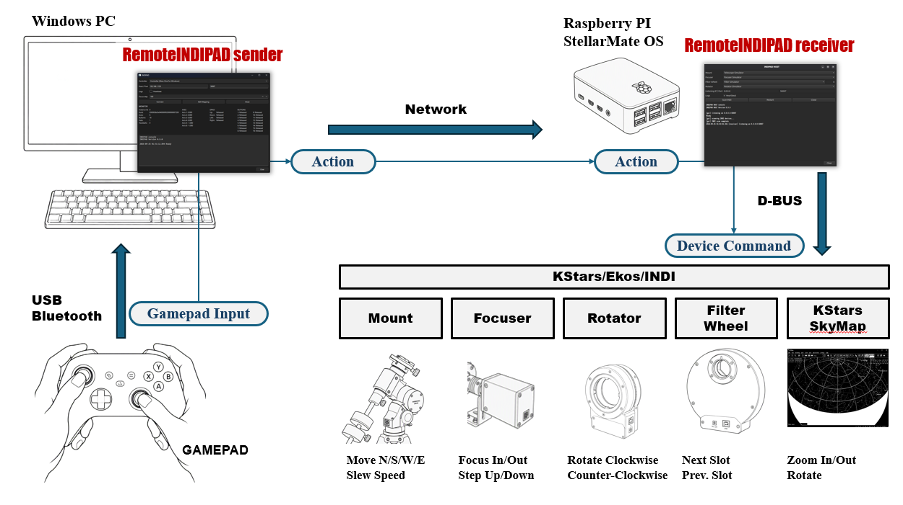
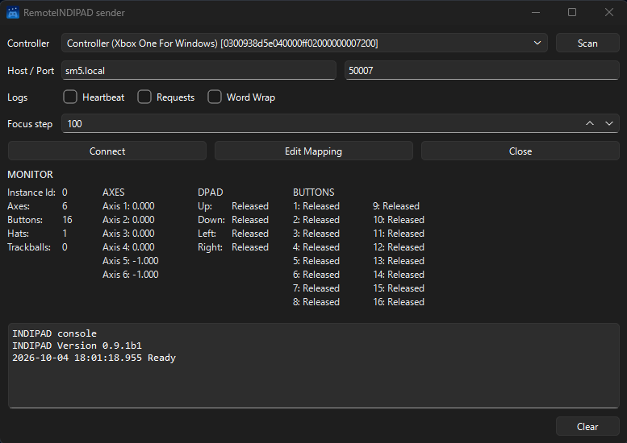
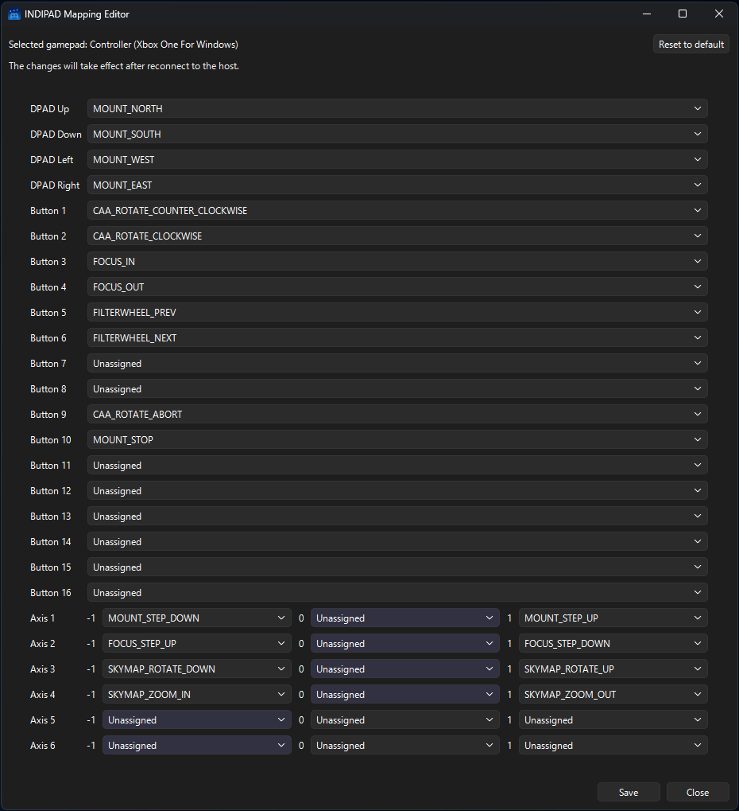
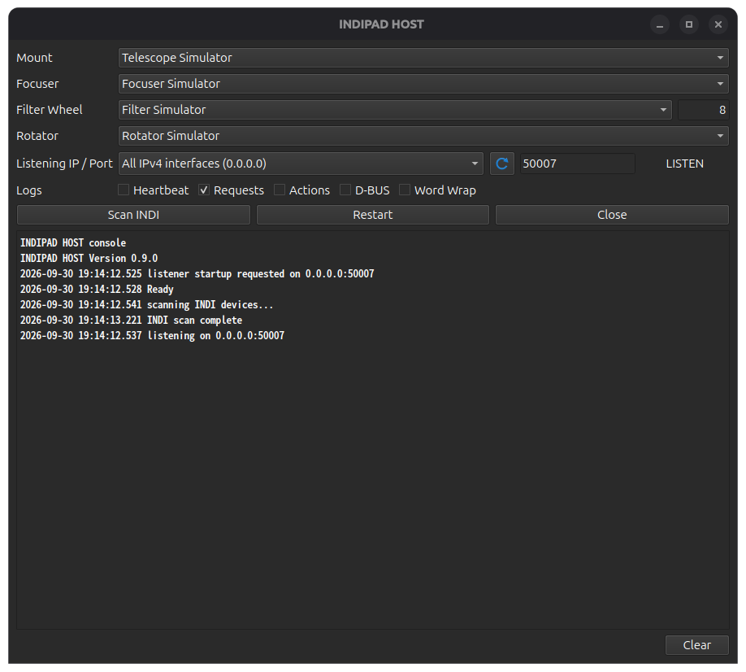

# RemoteINDIPAD

[日本語 README](README.ja.md)  
The Japanese README is the original documentation. If the English README appears uncertain, refer to the Japanese README.


A tool that transmits input from a gamepad connected to Windows over a LAN to KStars / Ekos / INDI on Linux, such as StellarMate OS or Ubuntu, allowing you to operate equipment including mounts, focusers, filter wheels, rotators, and the KStars SkyMap.

## Overview

- The project consists of two programs: a sender and a receiver.
- Sender (Windows): Captures gamepad input, converts it into abstract ”Actions”, and sends them over the network.
- Receiver (Linux): Converts the received abstract ”Actions” into D-BUS control commands for KStars / Ekos / INDI to operate the equipment.

> ⚠️ This program has been developed almost entirely with GitHub Copilot.
> Implementations in ways the developer did not anticipate, redundant code, and bugs may remain.



## Tested Devices

### GAMEPAD

- Microsoft Xbox Wireless Controller
- ELECOM JC-U3712T
- 8BitDo Zero 2

### INDI Devices

- Juwei 17
- GEMINI EAF
- ZWO CAA
- ToupTek AWF-L

## Controllable KStars / Ekos / INDI Features

### KStars

- SkyMap: Zoom in, zoom out, and rotate the map

### INDI

- MOUNT: Slew, increase or decrease speed, and stop slewing
- FOCUSER: Focus in, focus out, and increase or decrease the step count
- Rotator: Rotate and stop rotation
- Filter wheel: Change the filter slot

## Distribution

Three distribution formats are available. Choose whichever suits you best.

| Format | Description |
| - | - |
| Executable | A single executable created with PyInstaller. It is the easiest option because it requires little setup, but it may fail if the build and runtime environments differ. |
| Wheel file | A Python package installed with `pip`. This is worth considering if you already have a Python environment. |
| GitHub repository | Includes the development source code and related files. |

## Using the Executable

- The executable format consists of files created with PyInstaller from the script-format files described below, allowing them to be run as single files.
- No additional files are required. (This has not been thoroughly verified.)
- Builds are available for Windows x64, Linux aarch64, and Linux x64.
- The Linux aarch64 build is intended for Raspberry Pi devices running StellarMate OS and similar systems.

### Download the Executable Archive

Download `RemoteINDIPAD-windows-x64.zip` for Windows and `RemoteINDIPAD-linux-aarch64.tar.gz` for StellarMate OS from [Releases](https://github.com/jctk/RemoteINDIPAD/releases).

### Extract the Executable Files

1. On Windows, extract `RemoteINDIPAD-windows-x64.zip`, and place `remote_indipad_sender.exe` and `gamepad_profiles.json` in the same folder of your choice.
2. On StellarMate OS, extract `RemoteINDIPAD-linux-aarch64.tar.gz`, and place `remote_indipad_receiver` in a folder of your choice.

### Launching the Programs

- For usage instructions other than how to launch the programs, see [Usage](#usage).

#### Windows

```powershell
# Launch RemoteINDIPAD sender.
remote_indipad_sender
```

#### Linux, such as StellarMate OS

```bash
# Launch RemoteINDIPAD receiver.
remote_indipad_receiver
```

## Using the Wheel File

- Install the wheel file with `pip install`.
- Python must be installed.
- Required packages are installed when you run `pip install`.
- Installing in a Python virtual environment (venv) is recommended.

### Download the Wheel File

Download the wheel for the OS you intend to use from [Releases](https://github.com/jctk/RemoteINDIPAD/releases).

- Windows (Sender): `remoteindipad_sender-<version>-py3-none-any.whl`
- Linux (Receiver): `remoteindipad_receiver-<version>-py3-none-any.whl`

The wheels are split by OS: the Windows wheel contains the sender and `gamepad_profiles.json`; the Linux wheel contains only the receiver.
Run `python -m build --wheel` once from the repository root to create both wheels in the `dist` directory:

```powershell
python -m pip install --upgrade build
python -m build --wheel
```

### Install with pip

- Run these commands in an environment with Python installed.

```bash
# Create a venv with the current Python version (Linux)
cd <installation-directory>

# Create and activate the venv
python -m venv .venv
source .venv/bin/activate

# Install the Linux Receiver wheel
pip install <path-to-downloaded-wheel>/remoteindipad_receiver-<version>-py3-none-any.whl
```

```powershell
# Create a venv with the current Python version (Windows)
cd <installation-directory>

# Create and activate the venv
python -m venv .venv
.venv\Scripts\Activate.ps1

# Install the Windows Sender wheel
pip install <path-to-downloaded-wheel>/remoteindipad_sender-<version>-py3-none-any.whl
```

```bash
# Create a venv with a specified Python version (Linux)
cd <installation-directory>

# Create and activate the venv
uv venv --python 3.13 --seed .venv
source .venv/bin/activate

# Install the Linux Receiver wheel
pip install <path-to-downloaded-wheel>/remoteindipad_receiver-<version>-py3-none-any.whl
```

- To install directly from a wheel URL without downloading it, use the wheel for the target OS:

```bash
# Example: Linux Receiver
pip install https://github.com/jctk/RemoteINDIPAD/releases/download/<release-tag>/remoteindipad_receiver-<version>-py3-none-any.whl
```

### Launching the Programs

- For usage instructions other than how to launch the programs, see [Usage](#usage).

#### Windows

```powershell
# Activate the venv if you are using one.
.venv\Scripts\Activate.ps1
# Launch RemoteINDIPAD sender.
remote_indipad_sender
```

#### Linux, such as StellarMate OS

```bash
# Activate the venv if you are using one.
source .venv/bin/activate
# Launch RemoteINDIPAD receiver.
remote_indipad_receiver
```

## Usage

See the instructions for each distribution format for how to launch the programs.

1. Start KStars on StellarMate OS and start the Ekos Profile. If you are using a mount, unpark it first.
1. Start `remote_indipad_receiver` on StellarMate OS.
1. The device names from the started Ekos Profile are displayed in the Mount / Focuser / Filter Wheel / Rotator dropdown lists. If multiple devices of the same type are connected, select one manually from the appropriate dropdown list.
1. Click `[Start]` on the receiver to listen for a connection. Its status changes to `LISTEN`.
1. Connect the GAMEPAD to the Windows PC.
1. Start `remote_indipad_sender.exe` on Windows.
1. Select the GAMEPAD to use in `[Controller]`, then click `[Edit Mapping]` to open the INDIPAD Mapping Editor. Map the DPAD / Buttons / Axes to KStars / INDI operations. When mapping is complete, close the INDIPAD Mapping Editor with `[Close]`.
1. Enter the IP address of StellarMate OS in `[Host]`, then click `[Connect]` to connect to `remote_indipad_receiver` on StellarMate OS. Once connected, both consoles log the connection.
1. Operate the equipment with the GAMEPAD.

> ⚠️ Start with conservative movements and verify operation first. In particular, abnormal behavior of a mount or rotator may damage the equipment. Make sure you can stop the equipment at any time.

## User Interface

### RemoteINDIPAD sender

RemoteINDIPAD sender replaces input from a GAMEPAD connected to Windows with abstracted "Actions" and sends them to RemoteINDIPAD receiver over the network.



| Item | Description |
| - | - |
| Controller | Select the GAMEPAD to use. The Scan button refreshes the list to reflect controllers connected or disconnected after startup. |
| Host / Port | The IP address of StellarMate OS and the port configured for the RemoteINDIPAD receiver (default: 50007). |
| Logs - Heartbeat | Display transmitted heartbeats in the console. |
| Logs - Requests | Display JSON packets sent to the receiver in the console. |
| Logs - Word Wrap | Wrap console log lines to the window width. |
| Focus step | The step size for focus in/out operations. |
| Connect / Disconnect | Connect to or disconnect from the RemoteINDIPAD receiver. |
| Edit Mapping | Open the INDIPAD Mapping Editor. |
| Close | Close RemoteINDIPAD sender. |
| MONITOR | Display GAMEPAD information and the current axis, DPAD, and button states. |
| INDIPAD console | Display operation and communication status. |
| Clear | Clear the console. |

### RemoteINDIPAD sender - INDIPAD Mapping Editor

The INDIPAD Mapping Editor is used to edit assignments of abstracted Actions to the GAMEPAD DPAD, buttons, and axes.

- The corresponding list is highlighted when the GAMEPAD is operated.
- Axes return decimal values from -1 to 1 and are normalized to -1, 0, or 1 based on the default -0.6 to 0.6 thresholds.
- Axes are at one of -1, 0, or 1 by default. Note that the triggers on Xbox controllers are at -1 in their default state.
- The physical number of GAMEPAD DPAD inputs, buttons, and axes may differ from the number reported by the GAMEPAD driver.



| Item | Description |
| - | - |
| Save | Save the mapping settings. |
| Close | Close the INDIPAD Mapping Editor. |

### RemoteINDIPAD receiver

RemoteINDIPAD receiver converts the "Actions" received from RemoteINDIPAD sender over the network into D-BUS methods and controls KStars / Ekos / INDI.



| Item | Description |
| - | - |
| Mount | The name of an available MOUNT INDI driver. Select one from the list when multiple drivers are available. |
| Focuser | The name of an available focuser INDI driver. Select one from the list when multiple drivers are available. |
| Filter Wheel | The name of an available filter wheel INDI driver. Select one from the list when multiple drivers are available. The number after the INDI driver name is the number of filter wheel slots. |
| Rotator | The name of an available rotator INDI driver. Select one from the list when multiple drivers are available. |
| Listening IP / Port | Select an IPv4 or IPv6 address to listen on. The list includes localhost, detected local addresses, and an all-interfaces address for each IP version. Addresses that cannot be bound are shown as unavailable and disabled. The default is all IPv4 interfaces (`0.0.0.0`); the default port is 50007. Use the circular-arrow button to rescan network addresses. |
| Logs - Heartbeat | Display received heartbeats in the console. |
| Logs - Requests | Display JSON packets received from the sender in the console. |
| Logs - Actions | Display operation logs beginning with `action`, `dispatch`, or `executed` in the console. |
| Logs - D-BUS | Display D-BUS calls and returned results in the console. |
| Logs - Word Wrap | Wrap console log lines to the window width. |
| Scan INDI | Scan for available INDI drivers and populate each driver list. |
| Start / Stop | Toggle button. The receiver does not listen at launch and shows "Start". After Start reaches LISTEN it becomes "Stop". While LISTEN / ESTABLISHED, the INDI driver combos and [Scan INDI] are disabled. Stop ends LISTEN/ESTABLISHED, shows "---" for the status, and stops any running MOUNT_NORTH/SOUTH/WEST/EAST and CAA_ROTATE_COUNTER_CLOCKWISE/CAA_ROTATE_CLOCKWISE motion. |
| Close | Close RemoteINDIPAD receiver. |
| INDIPAD console | Display operation and communication status. |
| Clear | Clear the console. |

## Abstract Actions

The available abstract Actions are listed below.

| Device category | Abstract action | Operation |
| - | - | - |
| Mount | MOUNT_NORTH | Move the mount north while the button is held. |
| Mount | MOUNT_SOUTH | Move the mount south while the button is held. |
| Mount | MOUNT_WEST | Move the mount west while the button is held. |
| Mount | MOUNT_EAST | Move the mount east while the button is held. |
| Mount | MOUNT_STEP_UP | Increase the mount movement step by one level. |
| Mount | MOUNT_STEP_DOWN | Decrease the mount movement step by one level. |
| Mount | MOUNT_STOP | Stop mount movement (stop slewing). |
| Focuser | FOCUS_IN | Move the focuser's absolute step position closer. |
| Focuser | FOCUS_OUT | Move the focuser's absolute step position farther away. |
| Focuser | FOCUS_STEP_UP | Increase the focuser movement step count (5 -> 10 -> 50 -> 100 -> 500). |
| Focuser | FOCUS_STEP_DOWN | Decrease the focuser movement step count (5 <- 10 <- 50 <- 100 <- 500). |
| Filter wheel | FILTERWHEEL_PREV | Decrease the filter wheel slot number by one. |
| Filter wheel | FILTERWHEEL_NEXT | Increase the filter wheel slot number by one. |
| Rotator | CAA_ROTATE_COUNTER_CLOCKWISE | Rotate the rotator counterclockwise (toward decreasing angles) while the button is held. It rotates by 1 degree five times, then by 5 degrees three times, and by 10 degrees thereafter. |
| Rotator | CAA_ROTATE_CLOCKWISE | Rotate the rotator clockwise (toward increasing angles) while the button is held. It rotates by 1 degree five times, then by 5 degrees three times, and by 10 degrees thereafter. |
| Rotator | CAA_ROTATE_ABORT | Stop rotator rotation. |
| KStars SkyMap | SKYMAP_ZOOM_IN / SKYMAP_ZOOM_OUT | Zoom the SkyMap in or out. |
| KStars SkyMap | SKYMAP_ROTATE_UP / SKYMAP_ROTATE_DOWN | Rotate the SkyMap by 5 degrees. |

## FAQ

1. What should I do if running the executable version of RemoteINDIPAD receiver from a terminal displays missing-library messages or errors such as a segmentation violation?
    - This may occur because the environment where the executable was created differs from the environment where it is run.
    - Try the wheel file or the scripts in the GitHub repository.
1. Can RemoteINDIPAD receiver run on Windows?
    - It may run if the required Python modules are installed.
    However, Windows does not provide D-BUS functionality, and INDI drivers do not run there, so it can only be used to verify the connection between the sender and receiver.
1. Can RemoteINDIPAD sender run on Linux?
    - It may run if the required Python packages can be installed.
    - Even with the same GAMEPAD, the information obtained may differ from that obtained on Windows.
1. The RemoteINDIPAD receiver lists the Juwei-17 as a focuser.
    - The Juwei-17 is currently identified as such because it has multiple attributes in addition to being a mount.
    - This is because the `driverInterface` for Juwei-17 is set to 141 (10001101), which corresponds to the definitions for WEATHER_INTERFACE, FOCUSER_INTERFACE, GUIDER_INTERFACE, and TELESCOPE_INTERFACE.

## Using the GitHub Repository

- This is the development environment for the RemoteINDIPAD GitHub repository.

### Requirements

- Sender (Windows)
  - Windows 11
  - Python 3.10 or later
  - `pygame` (for obtaining gamepad input)
  - `pyside6` (GUI)
- Receiver (Linux)
  - A Linux environment such as StellarMate OS 2.x or Ubuntu
  - Python 3.10 or later
  - `pyside6` (GUI)
  - QtDBus, provided by PySide6 on supported Linux platforms (KStars / Ekos / INDI integration)

The receiver can also run on Windows for TCP communication testing. KStars / INDI control is unavailable there.

### Installation

#### Sender (Windows)

```powershell
cd ~
mkdir Projects
cd Projects
git clone https://github.com/jctk/RemoteINDIPAD.git
cd RemoteINDIPAD

python -m venv .venv
.venv\Scripts\activate.ps1
pip install pygame pyside6
```

#### Receiver (Linux)

```bash
cd ~
mkdir Projects
cd Projects
git clone https://github.com/jctk/RemoteINDIPAD.git
cd RemoteINDIPAD

python -m venv .venv
source .venv/bin/activate
pip install pyside6
```

### Starting the Scripts

- Start each script with Python.
- For usage instructions other than how to start the programs, see [Usage](#usage).

#### Windows

```powershell
.venv\Scripts\activate.ps1
python remote_indipad_sender.py
```

#### StellarMate OS

```bash
source .venv/bin/activate
python remote_indipad_receiver.py
```

### Building the Distribution Files

#### PyInstaller Executables

Run `python build-pyinstaller.py` from the repository root to build the executable for the current OS. The output is placed in the `release` directory.

#### Wheels

Run `python -m build --wheel` once from the repository root to create both the Sender and Receiver wheels in the `dist` directory.

```powershell
python -m pip install --upgrade build
python -m build --wheel
```

## License

Copyrighted works in this project, including the RemoteINDIPAD source code, configuration files, and documentation (excluding third-party libraries), may be used, modified, and redistributed under the terms of the MIT License.

Third-party libraries and related components included in the distributions are subject to their respective license terms. Check the licenses and copyright notices for each library before using, modifying, or redistributing them.

The main dependency libraries currently identified are as follows:

- `pygame`: GNU LGPL 2.1
- `PySide6` / Qt for Python: LGPL 3.0, GPL, or a commercial license
- `PyInstaller`: GPL 2.0 or later, with a special exception permitting distribution of applications created with PyInstaller
- Python standard library: Python Software Foundation License

The license texts that have been checked are stored in the [license](license/) folder. For dependencies not listed here, including components used internally by PySide6, Qt, and pygame, check the license terms applicable to the versions and distribution formats you actually use.

In particular, when distributing an executable that uses PySide6, comply with the LGPL terms, retain the Qt / PySide6 license notices, and do not unjustifiably prevent users from replacing the relevant libraries. Executables created with PyInstaller are also subject to the terms of every bundled dependency, in addition to PyInstaller's own exception.